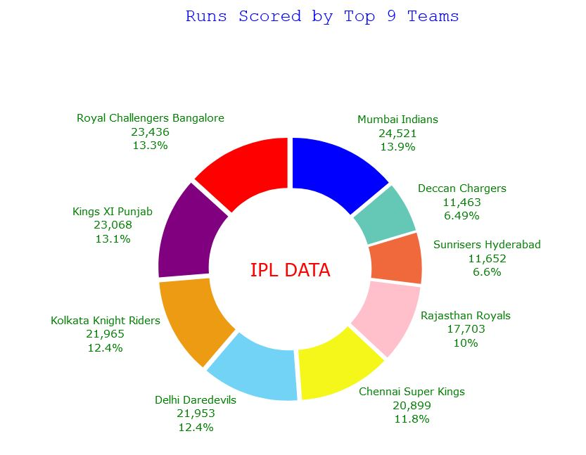
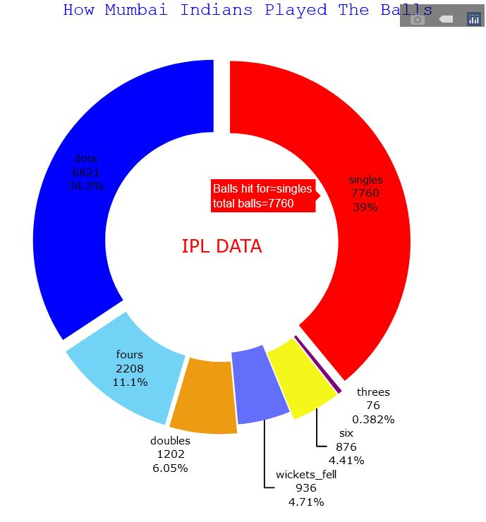
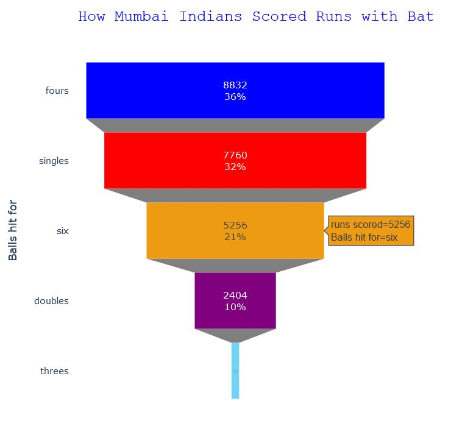
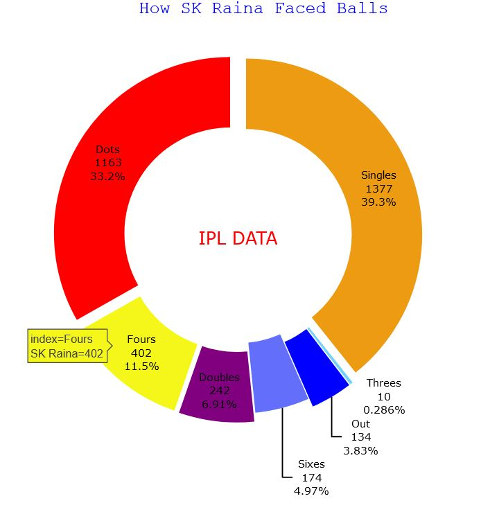
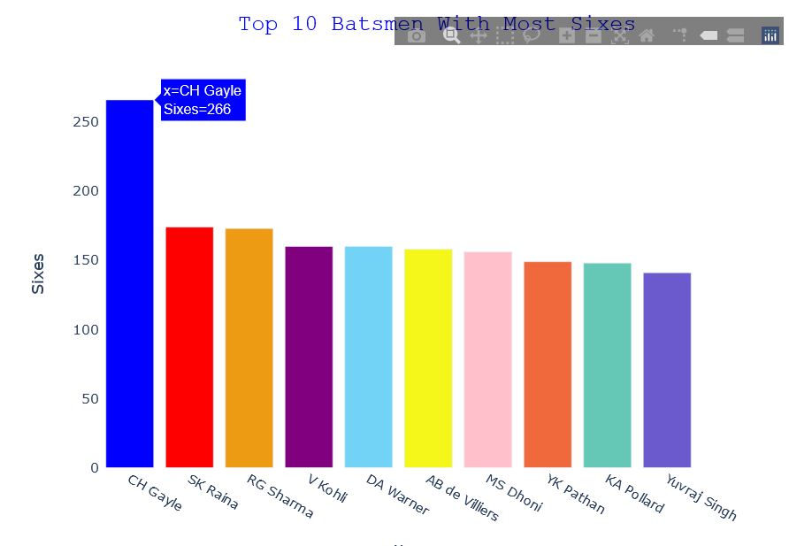
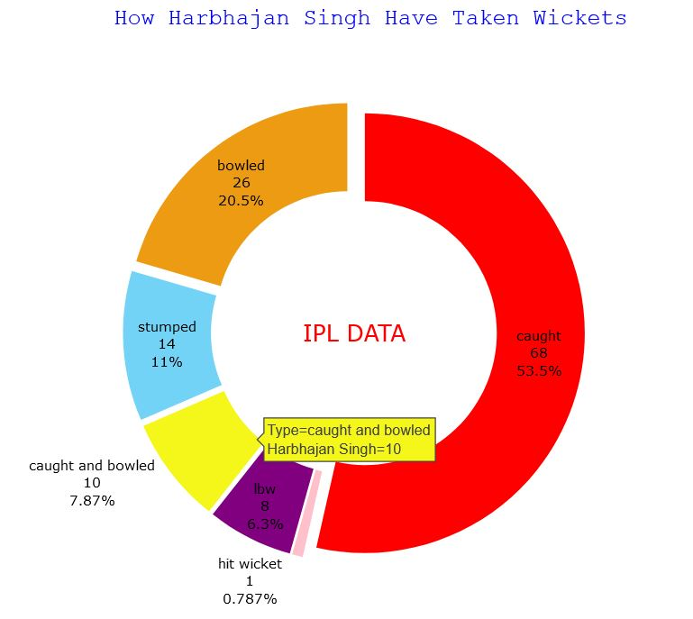
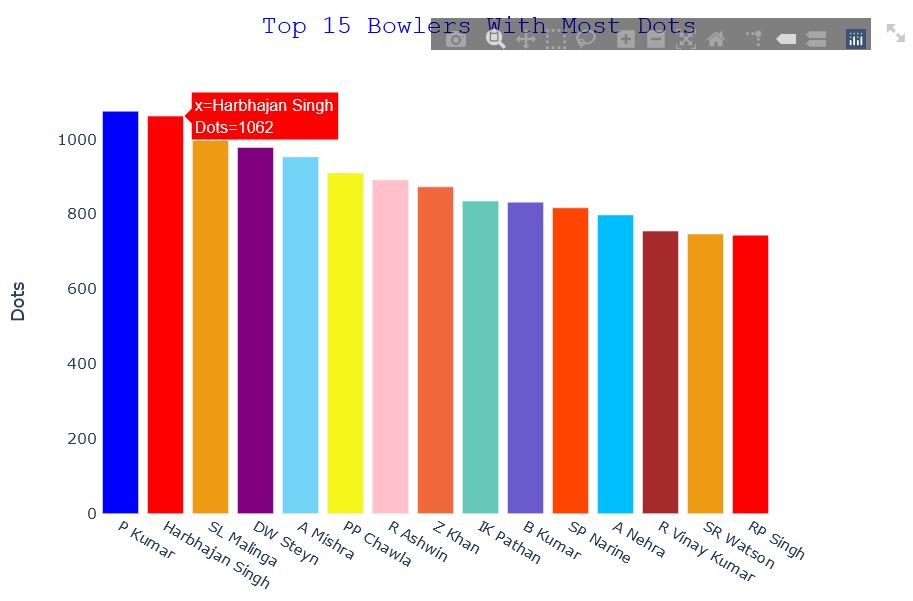
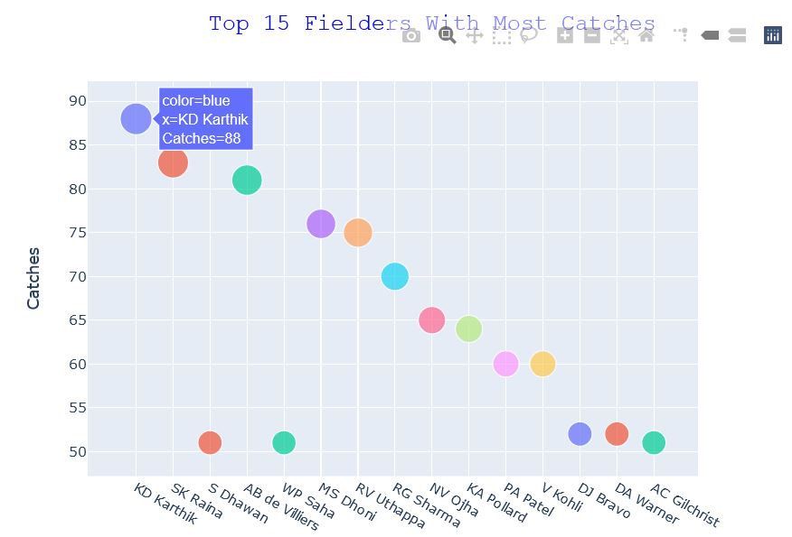
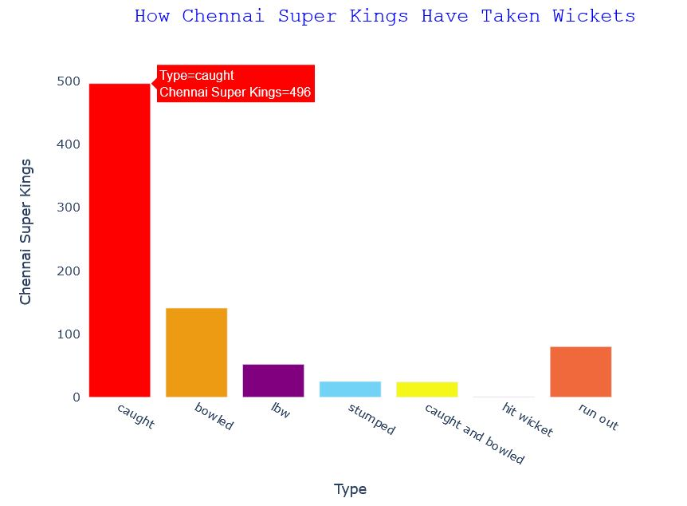
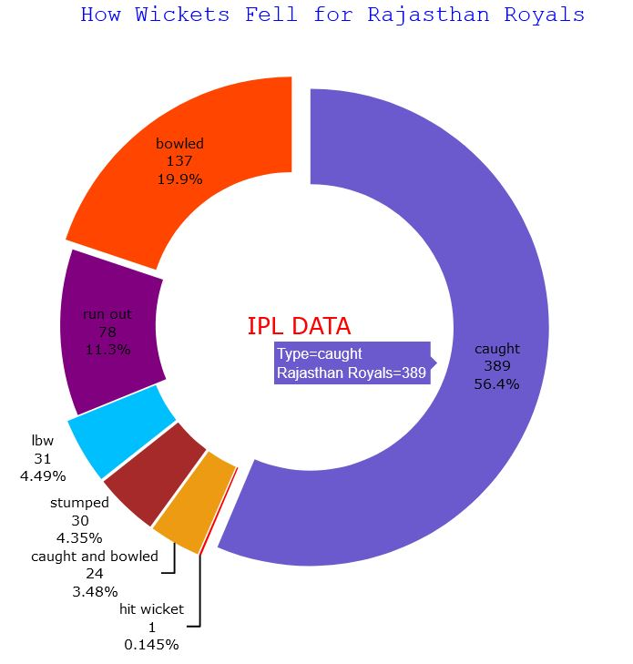

# IPL Data Analysis and Score Prediction
[IPL Data Analysis and Score Prediction App](https://ipl--analysis.herokuapp.com/)

It is a web app where all the IPL stats from 2008 to 2017 are present in numeric form as well as in graphic form.
A score predictor is also there that takes in some input and predicts the final score based on inputs. 
So, first data is analysed and it is cleaned to be used for visualization. There are many interesing insights
that are also been visualized for clearly understanding the stats and records in IPL.

## Application Contents
1. Score Predictor
2. Team Stats
3. Batting Stats
4. Bowling Stats
5. Fielding Stats
6. Other Interesting Stats

## Datasets Used
### 1. For Data Analysis and Visualization

### 2. For Score Prediction

## Some Stats present and Visualized in app
### 1. Runs Scored by Top 9 Teams in IPL

This Pie chart shows that Mumbai Indians have scored most number of runs in IPL i.e 13.9% of total runs and Sunrisers Hyderabad have scored lowest percent of runs i.e 6.6%

### 2. How a Particular Team Played Balls

This Pie chart shows how Mumbai Indians played balls. That is 34.3% balls are dot balls, 39% balls are hit for single 11.1% balls are hit for fours and only 4% balls are hit for six.

### 3. How a Particular Team Scored Runs

This funnel chart shows how Mumbai Indians have scored runs. That is, 36% runs are scored from fours, 32% runs from singles, 21% runs from sixes and 10% runs from doubles.

### 4. How a Particular Player Scored Runs

This Pie Chart shows how Suresh Raina have faced balls in IPL. 33.2% dot balls, on 39.3% balls single is taken, 11.5% balls are hit for fours by Suresh Raina.  

### 5. Querry Based Batting Stats

Above Bar Chart shows Top 10 Batsman with highest number of sixes hit in IPL. Gayle with 266 sixes is on way ahead from other batsmen.

### 6. How a Particular Bowler Took Wickets

Above Pie Chart shows how Harbhajan Singh have taken wickets in IPL. 20.5% of his wickets are bowled, 53.5% wickets are caught and 11% wickets are stumped.

### 7. Querry Based Bowling Stats

This Bar Chart shows Top 15 Bowlers who have bowled most number of dot balls in IPL. So Praveen Kumar is the the bowler with most number of dot balls in IPL.

### 8. Fielders With Most Catches

Above Bubble Chart shows Top 15 Fielders with most number of catches. Most of thse players are wicketkeepers as they are players with fixed fielding position on field. 

### 9. How a Particular Team Took Wickets

Above Bar Graph shows how Chennai Super Kings have taken wickets in IPL. Most of wickets are taken as catch. Exact figure for catches is 496.

### 10. How Wickets Fell for a Particular Team

Above Graph shows how Wickets fell for Rajasthan Royals in IPL. 56.4% of their wickets fell as catches, 20% wickets fell as bowled and 11.3% times the Rajasthan batsmen got Run Out.

